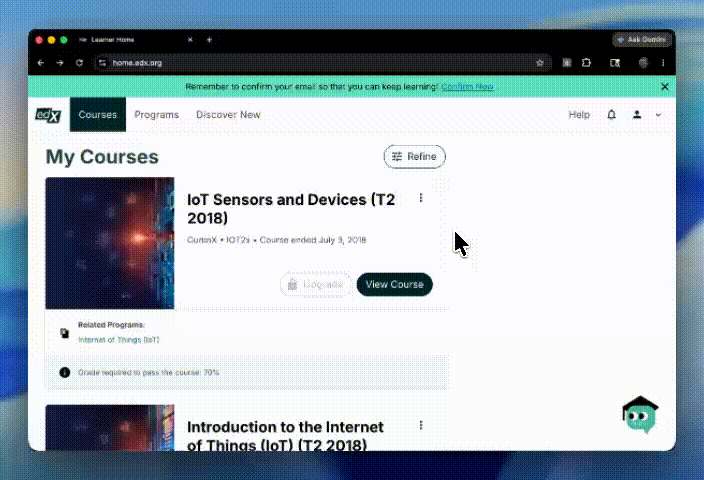

# Hướng dẫn Cài đặt & Sử dụng edX Pro Automator Tomoimoi 🚀

Tiện ích tự động hóa học tập trên edX.

---

## 📦 Hướng dẫn cài đặt (Chrome / Cốc Cốc / Edge)

1. Tải về tệp tin **[edxauto.zip](https://raw.githubusercontent.com/minhqnd/edx-tool-auto/refs/heads/main/edxauto.zip)** và **giải nén** ra máy tính của bạn.
2. Mở trình duyệt Chrome, truy cập địa chỉ: **`chrome://extensions/`**
3. Bật công tắc **"Chế độ dành cho nhà phát triển"** (Developer mode) ở góc trên bên phải.
4. Bấm nút **"Tải tiện ích đã giải nén"** (Load unpacked) ở góc trên bên trái.
5. Tìm và chọn thư mục vừa giải nén ở Bước 1 để hoàn tất cài đặt.

---

## 🛠️ Hướng dẫn sử dụng

1. Mở trang bài học khóa học của bạn trên edX (ví dụ: [learning.edx.org/course/course-v1:CurtinX+IOT2x+2T2018](https://learning.edx.org/course/course-v1:CurtinX+IOT2x+2T2018)).
2. Click vào biểu tượng **edX Tomoimoi** trên thanh công cụ trình duyệt (bên cạnh thanh địa chỉ).
3. Nhập mã bản quyền (**License Key**) của bạn và bấm **Activate & Sync Course**.
4. Tiện ích sẽ tự động chạy, xem video, đọc tài liệu và tự chuyển bài tiếp theo.

👉 Liên hệ để được cung cấp **License Key**: https://www.facebook.com/huyy.556817

---

## ⚖️ Tuyên bố miễn trừ trách nhiệm (Disclaimer)
* Công cụ này được phát triển phục vụ cho mục đích học tập, nghiên cứu và tối ưu học tập cá nhân. Người dùng tự chịu hoàn toàn trách nhiệm đối với mọi rủi ro liên quan đến tài khoản học tập edX của mình khi sử dụng tiện ích này. Chúng tôi không chịu trách nhiệm cho bất kỳ vấn đề phát sinh nào từ phía nền tảng.
